# Turn Your Web App into a Telegram Web App (TWA) using @BotFather

## Submit Your Solution

-   Submit your deeplink in the README.md in the [solutions folder](solution/README.md)

## Live Demo Example

View [Live Demo](http://t.me/FlowTelegramTestBot/app)

View [Example Solution](example/README.md)

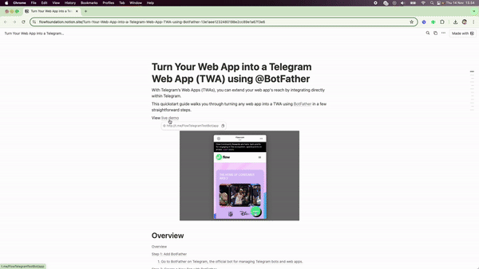

---

Turn any Web App into a Telegram Web App (TWA).

With Telegram’s Web Apps, you can extend your web app's reach by integrating directly within Telegram.

This quickstart guide walks you through turning any web app into a TWA using [BotFather](https://t.me/BotFather) in a few straightforward steps.

## Step 1: Add BotFather

### 1. Go to [BotFather on Telegram](https://t.me/BotFather), the official bot for managing Telegram bots and web apps.

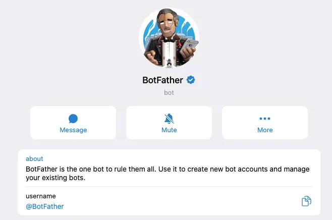

## Step 2: Create a New Bot with BotFather

### 1. In the chat with BotFather, use the command `/newbot` Follow the prompts to give your bot a name and a unique username

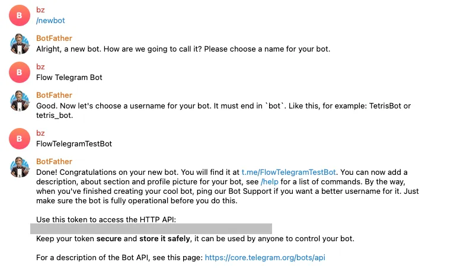

## Step 3: Register a New Web App

### 1. Use the command `/newapp` to register your web app.

### 2. Select the bot you just created.

### 3. Provide the following details:

-   **Title** – The title of your web app.
-   **Short Description** – A brief description to help users understand the app.
-   **Photo** – Upload an image (640x360 pixels) that represents your app.
-   **Demo GIF** – Optional. Upload a short GIF demo of your app, or use `/empty` to skip.
-   **Web App URL** – Enter the URL of your web app.
-   **Short Name** – Choose a unique identifier for your app, which will be used in your deep link.

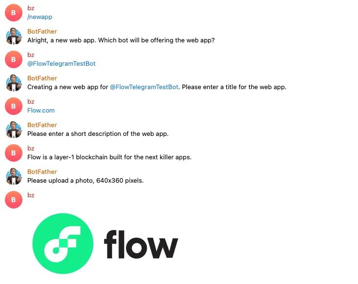
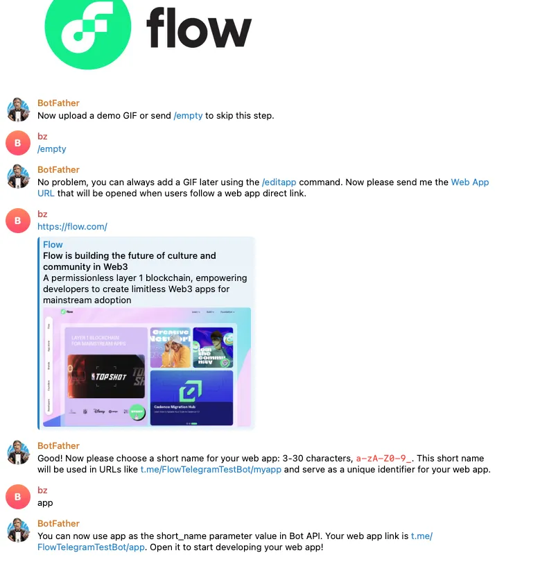

## **Step 4:** Access Your TWA Link

### 1. After completing the steps, you’ll receive a deep link to your Telegram Web App. It will look something like this: [`t.me/FlowTelegramTestBot/app`](t.me/FlowTelegramTestBot/app)

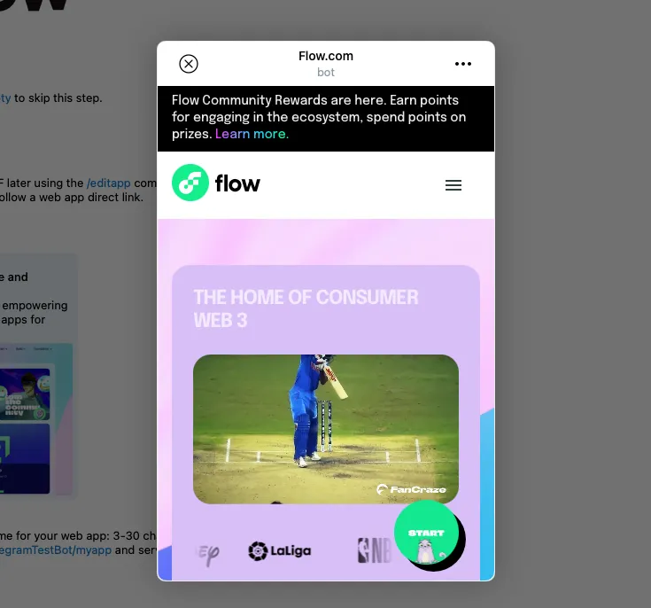

## **Step 5:** Configure menu button

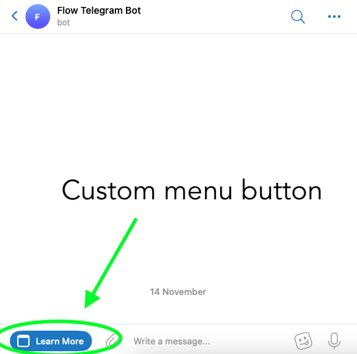

### 1. Use the command `/mybots` and choose your Telegram bot to access bot settings

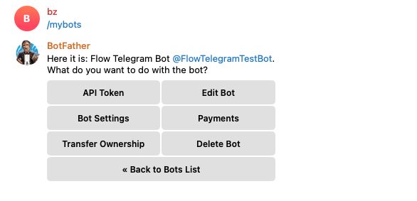

### 2. Select `Bot Settings` -> `Menu Button` -> `Configure menu button`

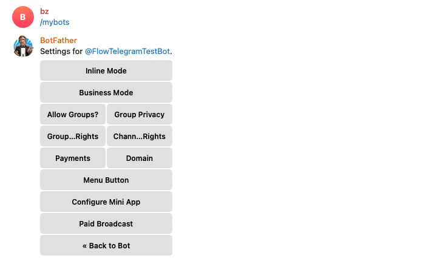

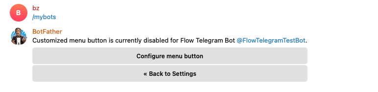

### 3. Enter the Web App URL and the title to be displayed on the button

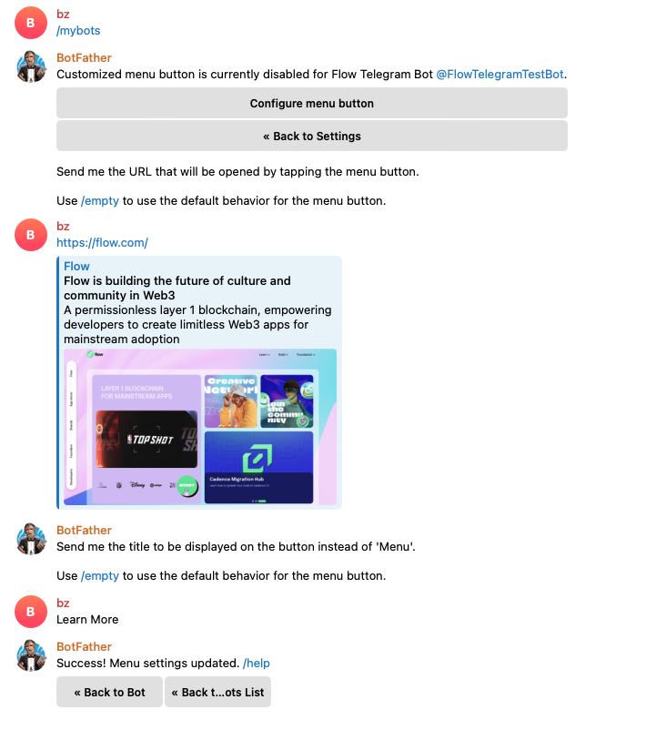

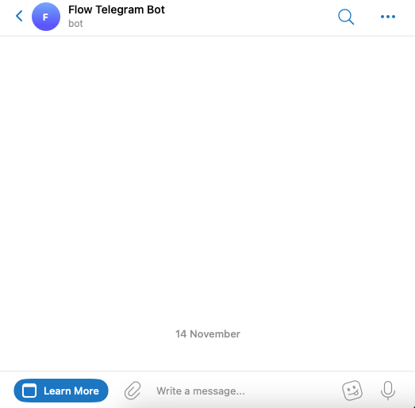

## Conclusion

And that’s it! With just a few steps, your web app is now accessible as a Telegram Web App, opening up new ways for users to engage with your app directly within Telegram. Happy building!
