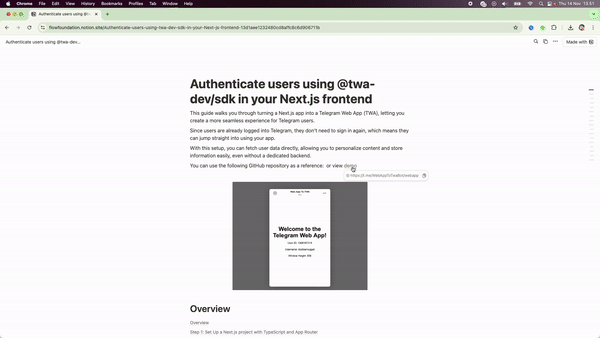
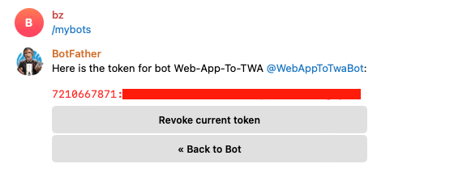
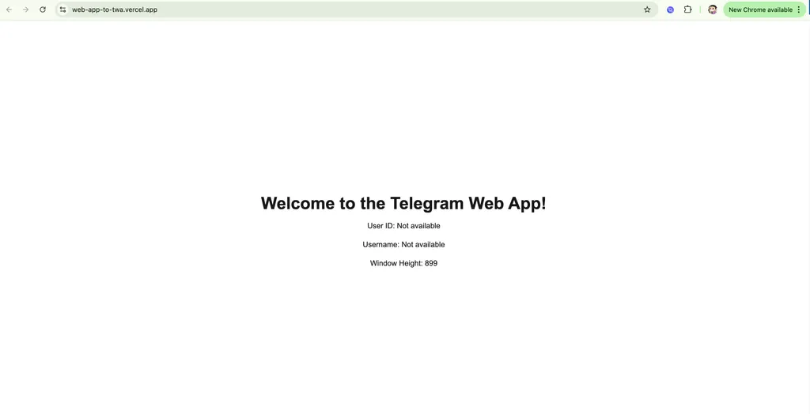
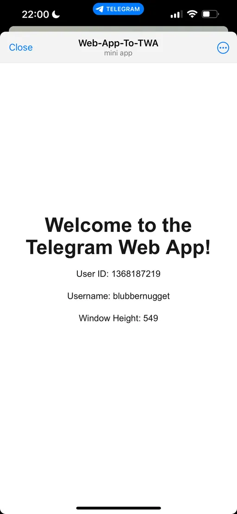

# Authenticate users using @twa-dev/sdk in your Next.js frontend

## Submit Your Solution

-   Submit your deeplink and GitHub repo in the README.md in the [solutions folder](solution/README.md)

## Example

View [Live Demo](https://t.me/WebAppToTwaBot/webapp)

View [Example Code](example/web-app-to-twa-main/)



---

This guide walks you through turning a Next.js app into a Telegram Web App (TWA), letting you create a more seamless experience for Telegram users.

Since users are already logged into Telegram, they don’t need to sign in again, which means they can jump straight into using your app.

With this setup, you can fetch user data directly, allowing you to personalize content and store information easily, even without a dedicated backend.

## Step 1: Set Up a Next.js project with TypeScript and App Router

### 1. Run the command in your terminal

```bash 
npx create-next-app@latest my-telegram-app --typescript --use-npm
```
### 2. Navigate to Your Project Directory

```bash 
cd my-telegram-app
```
### 3. Install the @twa-dev/sdk and @telegram-apps/init-data-node with the —legacy-peer-deps flag

```bash 
npm install @twa-dev/sdk @telegram-apps/init-data-node --legacy-peer-deps
```

## Step 2: Create a Telegram Bot and get your Bot ID

### 1. Go to [BotFather](https://t.me/BotFather) on Telegram and create a new bot

```bash
/newbot
```

### 2. Save your bot id which is the numbers before the colon `:` in your bot api token



## Step 3: Set Up the Authentication Context

We’ll use React’s Context API to manage authentication and Telegram Web App data, making it available across our app.

### 1. Create an `AuthContext.tsx` in a new `context` folder under `app` and add your bot id

### Note: Make sure to replace the `botId` with your actual bot id

```typescript
// app/context/AuthContext.tsx
'use client';

import React, { createContext, useContext, useEffect, useState } from 'react';
import WebApp from '@twa-dev/sdk';
import { validate3rd } from '@telegram-apps/init-data-node/web';

type AuthContextType = {
	userID: number | null;
	username: string | null;
	windowHeight: number;
	isDataValid: boolean;
};

const AuthContext = createContext<AuthContextType | undefined>(undefined);

export const AuthContextProvider = ({
	children,
}: {
	children: React.ReactNode;
}) => {
	const [windowHeight, setWindowHeight] = useState<number>(0);
	const [userID, setUserID] = useState<number | null>(null);
	const [username, setUsername] = useState<string | null>(null);
	const [isDataValid, setIsDataValid] = useState<boolean>(false);

	useEffect(() => {
		// Ensure this code only runs on the client side
		if (typeof window !== 'undefined' && WebApp) {
			WebApp.isVerticalSwipesEnabled = false;
			setWindowHeight(WebApp.viewportStableHeight || window.innerHeight);
			WebApp.ready();

			// Validate Telegram data
			(async () => {
				try {
					const botId = 7210667871; // Replace with your actual bot ID
					await validate3rd(WebApp.initData, botId); // Validate initData
					setIsDataValid(true);
					const user = WebApp.initDataUnsafe.user; // Extract user data if valid
					setUserID(user?.id || null);
					setUsername(user?.username || null);
				} catch (error) {
					if (error instanceof Error) {
						console.error('Validation failed:', error.message);
					} else {
						console.error('Validation failed:', error);
					}
					setIsDataValid(false);
				}
			})();
		}
	}, []);

	const contextValue = {
		userID,
		username,
		windowHeight,
		isDataValid,
	};

	return (
		<AuthContext.Provider value={contextValue}>
			{children}
		</AuthContext.Provider>
	);
};

export const useAuth = () => {
	const context = useContext(AuthContext);
	if (context === undefined) {
		throw new Error('useAuth must be used within an AuthContextProvider');
	}
	return context;
};
```

## Step 4: Wrap your App with `AuthContextProvider`

1. Update `layout.tsx` to wrap the entire app

```typescript
// app/layout.tsx
import './globals.css';
import { AuthContextProvider } from '@/context/AuthContext';

export default function RootLayout({
	children,
}: Readonly<{
	children: React.ReactNode;
}>) {
	return (
		<html lang="en">
			<body>
				<AuthContextProvider>{children}</AuthContextProvider>
			</body>
		</html>
	);
}
```

## Step 5: Create DisplayUser.tsx and use it on Home Page

To test if it works, we’ll use the `useAuth` hook from `AuthContext` to access and display the Telegram-authenticated user’s ID, username, and viewport height.

### 1. Create `components/DisplayUser.tsx`

```typescript
// components/DisplayUser.tsx
'use client';

import { useAuth } from '@/context/AuthContext';

export default function DisplayUser() {
	const { userID, username, windowHeight, isDataValid } = useAuth();

	if (!isDataValid) {
		// Display a message if validation failed
		return (
			<div className="flex flex-col items-center justify-center min-h-screen text-center space-y-4">
				<h1 className="text-4xl font-bold text-red-600">
					Validation Failed
				</h1>
				<p className="text-lg">
					The data could not be validated. Please try reloading the
					app.
				</p>
			</div>
		);
	}

	// Display user data if validation succeeded
	return (
		<div className="flex flex-col items-center justify-center min-h-screen text-center space-y-4">
			<h1 className="text-4xl font-bold">
				Welcome to the Telegram Web App!
			</h1>
			<p>User ID: {userID || 'Not available'}</p>
			<p>Username: {username || 'Not available'}</p>
			<p>Window Height: {windowHeight}</p>
		</div>
	);
}
```

### 2. Update `app/page.tsx`

```typescript
// app/page.tsx
import DisplayUser from '@/components/DisplayUser';

export default function Home() {
	return (
		<div>
			<DisplayUser />
		</div>
	);
}
```

## Step 6: Deploy your frontend to Vercel

### 1. Deploy your Next.js app to [Vercel](https://vercel.com/) (or your preferred hosting platform)



## Step 7: Create a Telegram Bot and Turn your Web App into a TWA

### 1. Go to [BotFather](https://t.me/BotFather) on Telegram and use `/newapp` command in BotFather to turn your web app into a TWA

```bash
/newapp
```

### 2. Set your bot’s domain to your deployment URL (e.g. https://web-app-to-twa.vercel.app/)

This will create a deep link (e.g. https://t.me/WebAppToTwaBot/webapp) that you can access to check if your telegram web app display’s the user’s id and username



If you have followed the steps correctly you should see something similar as the above through your telegram app (on mobile). 

As the initData is being validated that it's signed by Telegram, the TWA will only display user's id and username when it's being viewed from the Telegram mobile app

## Conclusion

This tutorial takes you through setting up a Next.js app with TypeScript, configuring a Telegram Web App with @twa-dev/sdk, and displaying authenticated user data from Telegram within your app.
