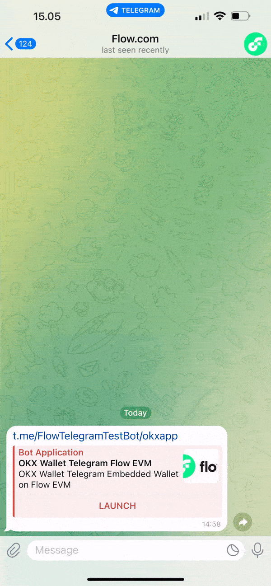
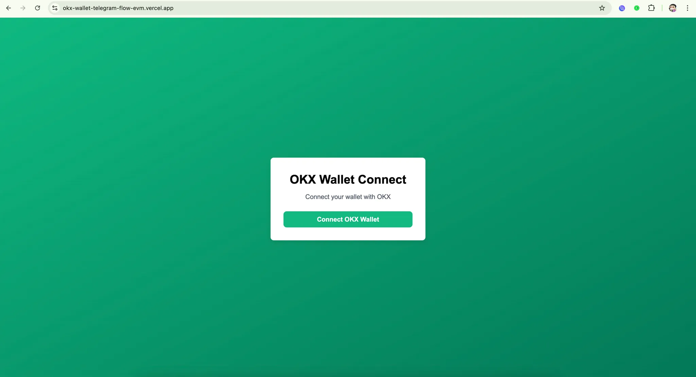
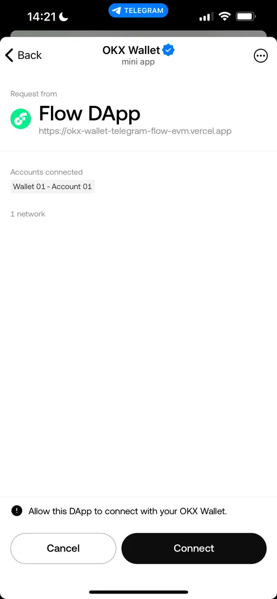

# Connect OKX Telegram Embedded Wallet on Flow EVM

## Submit Your Solution

-   Submit your deeplink and GitHub repo in the README.md in the [solutions folder](solution/README.md)

## Example

View [Live Demo](http://t.me/FlowTelegramTestBot/okxapp)

View [Example Code](example/okx-wallet-telegram-flow-evm-main/)



---

This guide covers connecting a OKX wallet as a Telegram Embedded wallet on Flow EVM

Flow is a layer-1 blockchain with two environments: Flow EVM and Flow Cadence. This guide is specifically for **Flow EVM**.

## Step 1: Set Up a Next.js project with TypeScript and App Router

### 1. Run the command in your terminal

```bash
npx create-next-app@latest my-app --typescript
```

### 2. Navigate to Your Project Directory

```bash
cd my-app
```

### 3. Install @okxconnect/ui

```bash
npm install @okxconnect/ui
```

# Step 2: Create `AuthContext.tsx`

Create `context` folder and `AuthContext.tsx` to provide authentication data to components across the app:

```tsx
// context/AuthContext.tsx
'use client';

import React, { createContext, useContext, useState, useEffect } from 'react';
import { OKXUniversalConnectUI, THEME } from '@okxconnect/ui';

interface AuthContextType {
	connected: boolean;
	walletAddress: string | null;
	chainId: string | null;
	logIn: () => Promise<void>;
	logOut: () => Promise<void>;
}

const AuthContext = createContext<AuthContextType | undefined>(undefined);

export const AuthContextProvider: React.FC<{ children: React.ReactNode }> = ({
	children,
}) => {
	const [client, setClient] = useState<OKXUniversalConnectUI | null>(null);
	const [walletAddress, setWalletAddress] = useState<string | null>(null);
	const [chainId, setChainId] = useState<string | null>(null);
	const [connected, setConnected] = useState(false);

	useEffect(() => {
		const initClient = async () => {
			try {
				const uiClient = await OKXUniversalConnectUI.init({
					dappMetaData: {
						name: 'Flow DApp',
						icon: 'https://cryptologos.cc/logos/flow-flow-logo.png',
					},
					actionsConfiguration: {
						returnStrategy: 'none', // Or 'tg://resolve'
						modals: 'all',
					},
					uiPreferences: {
						theme: THEME.LIGHT,
					},
				});
				setClient(uiClient);
			} catch (error) {
				console.error('Failed to initialize OKX UI:', error);
			}
		};
		initClient();
	}, []);

	const logIn = async () => {
		if (!client) return;
		try {
			const session = await client.openModal({
				namespaces: {
					eip155: {
						chains: ['eip155:747'],
						defaultChain: '747',
					},
				},
			});

			// Ensure session is defined
			if (!session || !session.namespaces.eip155) {
				console.error('Session is undefined or invalid');
				return;
			}

			const address =
				session.namespaces.eip155.accounts[0]?.split(':')[2];

			// Remove the "eip155:" prefix from the chainId
			const rawChainId = session.namespaces.eip155.chains[0];
			const chain = rawChainId?.split(':')[1] || null;

			setWalletAddress(address);
			setChainId(chain);
			setConnected(true);
		} catch (error) {
			console.error('Failed to connect wallet:', error);
		}
	};

	const logOut = async () => {
		if (!client) return;
		try {
			await client.disconnect();
			setWalletAddress(null);
			setChainId(null);
			setConnected(false);
		} catch (error) {
			console.error('Failed to disconnect wallet:', error);
		}
	};

	return (
		<AuthContext.Provider
			value={{
				connected,
				walletAddress,
				chainId,
				logIn,
				logOut,
			}}
		>
			{children}
		</AuthContext.Provider>
	);
};

export const useAuth = () => {
	const context = useContext(AuthContext);
	if (!context) {
		throw new Error('useAuth must be used within an AuthProvider');
	}
	return context;
};
```

# Step 3: Integrate Authentication in `layout.tsx`

Use `AuthContextProvider` in your main `layout.tsx` to make the context available globally:

```tsx
// app/layout.tsx
import './globals.css';
import { AuthContextProvider } from '@/context/AuthContext';

export default function RootLayout({
	children,
}: {
	children: React.ReactNode;
}) {
	return (
		<html lang="en">
			<body>
				<AuthContextProvider>{children}</AuthContextProvider>
			</body>
		</html>
	);
}
```

# Step 4: Create `WalletConnection.tsx`

Create `components` folder and `WalletConnection.tsx` to add buttons for logging in and out:

```tsx
// components/WalletConnection.tsx
'use client';

import { useAuth } from '@/context/AuthContext';

export default function WalletConnection() {
	const { connected, walletAddress, chainId, logIn, logOut } = useAuth();

	return (
		<div className="page-container">
			<div className="card">
				<h1 className="card-title">OKX Wallet Connect</h1>

				{connected ? (
					<div>
						<p className="card-subtitle">
							Thanks for connecting your wallet!
						</p>
						<div className="space-y-4">
							<p className="connected-text">
								Wallet Address:{' '}
								{walletAddress && (
									<span className="connected-username">
										{walletAddress}
									</span>
								)}
							</p>
							{chainId && (
								<p className="connected-text">
									Chain ID:{' '}
									<span className="connected-username">
										{chainId}
									</span>
								</p>
							)}
							<button
								onClick={logOut}
								className="button button-disconnect"
							>
								Disconnect Wallet
							</button>
						</div>
					</div>
				) : (
					<div>
						<p className="card-subtitle">
							Connect your wallet with OKX
						</p>
						<button
							onClick={logIn}
							className="button button-connect"
						>
							Connect OKX Wallet
						</button>
					</div>
				)}
			</div>
		</div>
	);
}
```

# Step 5: Add Optional Styles

(Optional) You can add a stylesheet using Tailwind CSS for basic styling. Here's a sample `globals.css` setup:

```css
/* globals.css */
@tailwind base;
@tailwind components;
@tailwind utilities;

:root {
	--background: #ffffff;
	--foreground: #171717;
}

@media (prefers-color-scheme: dark) {
	:root {
		--background: #0a0a0a;
		--foreground: #ededed;
	}
}

body {
	color: var(--foreground);
	background: var(--background);
	font-family: Arial, Helvetica, sans-serif;
}

.page-container {
	min-height: 100vh;
	display: flex;
	align-items: center;
	justify-content: center;
	background: linear-gradient(to bottom right, #10b981, #047857);
}

.card {
	background-color: #ffffff;
	border-radius: 0.5rem;
	box-shadow: 0px 4px 12px rgba(0, 0, 0, 0.1);
	padding: 2rem;
	width: 100%;
	max-width: 24rem;
}

.card-title {
	font-size: 1.875rem;
	font-weight: 700;
	text-align: center;
	margin-bottom: 0.5rem;
	color: black;
}

.card-subtitle {
	color: #4b5563;
	text-align: center;
	margin-bottom: 1.5rem;
}

.button {
	width: 100%;
	padding: 0.5rem 1rem;
	font-weight: 600;
	border-radius: 0.5rem;
	transition: background-color 0.2s ease-in-out;
	color: #ffffff;
}

.button-connect {
	background-color: #10b981;
}

.button-disconnect {
	background-color: #6b7280;
}
```

# Step 6: Deploy your frontend to Vercel

### 1. Deploy your Next.js app to [Vercel](https://vercel.com/) (or your preferred hosting platform)



# Step 7: Turn your Web App into a TWA

### 1. Go to [BotFather](https://t.me/BotFather) on Telegram and create a new bot

```bash
/newbot
```

### 2. Use `/newapp` command in BotFather to turn your web app into a TWA

```bash
/newapp
```

### 3. Set your bot’s domain to your deployment URL

This will create a deep link (e.g. [t.me/FlowTelegramTestBot/okxapp](https://t.me/FlowTelegramTestBot/okxapp)) that you can access via your phone to check if your telegram web app can connect with OKX Telegram embedded wallet.



# Conclusion

With these steps, you can set up a Next.js Telegram Web App that enables wallet connection with OKX Telegram embedded wallet on Flow EVM.
