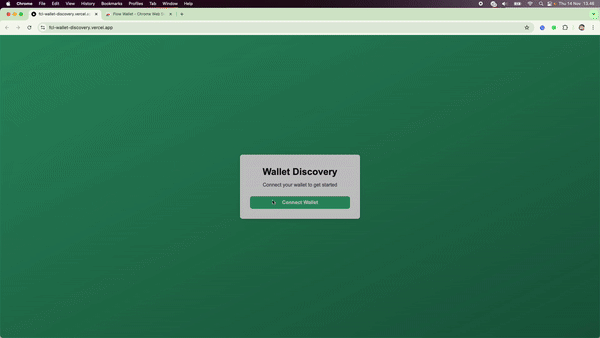
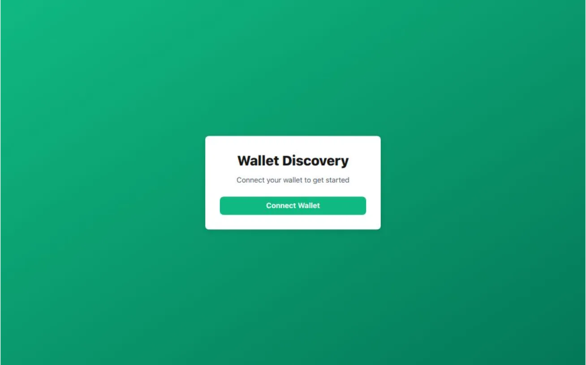

# Connect a Wallet on Flow Blockchain Cadence Environment

## Submit Your Solution

-   Submit your deeplink and GitHub repo in the README.md in the [solutions folder](solution/README.md)

## Example

View [Live Demo](https://fcl-wallet-discovery.vercel.app/)

View [Example Code](example/fcl-wallet-discovery-main/)



---

Connecting a wallet is essential for interacting with dApps, enabling secure transactions, and accessing blockchain features. This guide covers connecting a wallet on Flow Cadence to use Flow-native wallets, like Flow Wallet\* and Blocto.

Flow is a layer-1 blockchain with two environments: Flow EVM and Flow Cadence. This guide is specifically for **Flow Cadence**.

**\*Note:** [Flow Wallet](https://wallet.flow.com/) supports both Flow EVM and Flow Cadence.

## Step 1: Set Up a Next.js project with TypeScript and App Router

### 1. Run the command in your terminal

```bash 
npx create-next-app@latest my-app --typescript
```

### 2. Navigate to Your Project Directory

```bash 
cd my-app
```

### 3. Install @onflow/fcl and @onflow/types

```bash 
npm install --save @onflow/fcl @onflow/types
```
​
**\*Note:** Some setups may require pino-pretty. If you encounter any errors, run:
```bash 
npm install pino-pretty --save-dev
```

## Step 2: Configure Flow (`flow-config.ts`)

Create a new file in the root of your project called `flow-config.ts`. This file will hold the Flow configuration:

```bash
import { config } from '@onflow/fcl';

config({
	'accessNode.api': 'https://rest-mainnet.onflow.org',
	'flow.network': 'mainnet',
	'discovery.wallet': 'https://fcl-discovery.onflow.org/authn',
});
```

## Step 3: Create the `useCurrentUser` Hook

Create a `hooks` folder in your root and a custom hook called `use-current-user.hook.tsx` to handle authentication with Flow:

```typescript
// hooks/use-current-user.hook.tsx
'use client';

import { useEffect, useState } from 'react';
import * as fcl from '@onflow/fcl';

export default function useCurrentUser() {
	const [user, setUser] = useState({ addr: null });

	const logIn = () => {
		fcl.authenticate();
	};

	const logOut = () => {
		fcl.unauthenticate();
	};

	useEffect(() => {
		fcl.currentUser().subscribe(setUser);
	}, []);

	return [user, user?.addr != null, logIn, logOut];
}
```

## Step 4: Set Up the `AuthContext.tsx`

Create `context` folder and `AuthContext.tsx` to provide authentication data to components across the app:

```typescript
// context/AuthContext.tsx
'use client';

import React, { createContext, useContext } from 'react';
import useCurrentUser from '@/hooks/use-current-user.hook';

interface AuthContextType {
	user: any;
	loggedIn: any;
	logIn: any;
	logOut: any;
}

const AuthContext = createContext<AuthContextType | undefined>(undefined);

export const AuthContextProvider: React.FC<{ children: React.ReactNode }> = ({
	children,
}) => {
	const [user, loggedIn, logIn, logOut] = useCurrentUser();

	return (
		<AuthContext.Provider value={{ user, loggedIn, logIn, logOut }}>
			{children}
		</AuthContext.Provider>
	);
};

export const useAuth = () => {
	const context = useContext(AuthContext);
	if (!context) {
		throw new Error('useAuth must be used within an AuthContextProvider');
	}
	return context;
};
```

## Step 5: Integrate Authentication in `layout.tsx`

Use `AuthContextProvider` in your main `layout.tsx` to make the context available globally:

```typescript
// app/layout.tsx
'use client';

import './globals.css';
import { AuthContextProvider } from '@/context/AuthContext';
import '../flow-config';

export default function RootLayout({
	children,
}: {
	children: React.ReactNode;
}) {
	return (
		<html lang="en">
			<body suppressHydrationWarning={true}>
				<AuthContextProvider>{children}</AuthContextProvider>
			</body>
		</html>
	);
}
```

## Step 6: Create the Page with Connect Wallet button

In the your main `page.tsx` you can update it to add button for logging in and out:

```typescript
// app/page.tsx
'use client';

import { useAuth } from '@/context/AuthContext';

export default function Home() {
	const { user, loggedIn, logIn, logOut } = useAuth();

	return (
		<div className="page-container">
			<div className="card">
				<h1 className="card-title">Wallet Discovery</h1>
				<p className="card-subtitle">
					Connect your wallet to get started
				</p>

				{loggedIn ? (
					<div className="space-y-4">
						<p className="connected-text">
							Connected as:{' '}
							<span className="connected-username">
								{user?.addr}
							</span>
						</p>
						<button
							onClick={logOut}
							className="button button-disconnect"
						>
							Disconnect Wallet
						</button>
					</div>
				) : (
					<button onClick={logIn} className="button button-connect">
						Connect Wallet
					</button>
				)}
			</div>
		</div>
	);
}
```

## Step 7: Add Optional Styles

(Optional) You can add a stylesheet using Tailwind CSS for basic styling. Here's a sample `globals.css` setup:

```css
/* globals.css */
@tailwind base;
@tailwind components;
@tailwind utilities;

:root {
	--background: #ffffff;
	--foreground: #171717;
}

@media (prefers-color-scheme: dark) {
	:root {
		--background: #0a0a0a;
		--foreground: #ededed;
	}
}

body {
	color: var(--foreground);
	background: var(--background);
	font-family: Arial, Helvetica, sans-serif;
}

.page-container {
	min-height: 100vh;
	display: flex;
	align-items: center;
	justify-content: center;
	background: linear-gradient(to bottom right, #10b981, #047857);
}

.card {
	background-color: #ffffff;
	border-radius: 0.5rem;
	box-shadow: 0px 4px 12px rgba(0, 0, 0, 0.1);
	padding: 2rem;
	width: 100%;
	max-width: 24rem;
}

.card-title {
	font-size: 1.875rem;
	font-weight: 700;
	text-align: center;
	margin-bottom: 0.5rem;
}

.card-subtitle {
	color: #4b5563;
	text-align: center;
	margin-bottom: 1.5rem;
}

.button {
	width: 100%;
	padding: 0.5rem 1rem;
	font-weight: 600;
	border-radius: 0.5rem;
	transition: background-color 0.2s ease-in-out;
	color: #ffffff;
}

.button-connect {
	background-color: #10b981;
}

.button-disconnect {
	background-color: #6b7280;
}
```



## Conclusion

With these steps, you can set up a Next.js app that enables wallet connection on the Flow Blockchain in the Cadence environment, allowing users to authenticate and interact with Flow-native wallets like Flow Wallet and Blocto.
