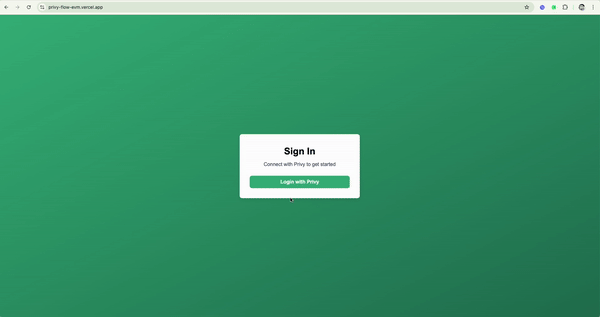
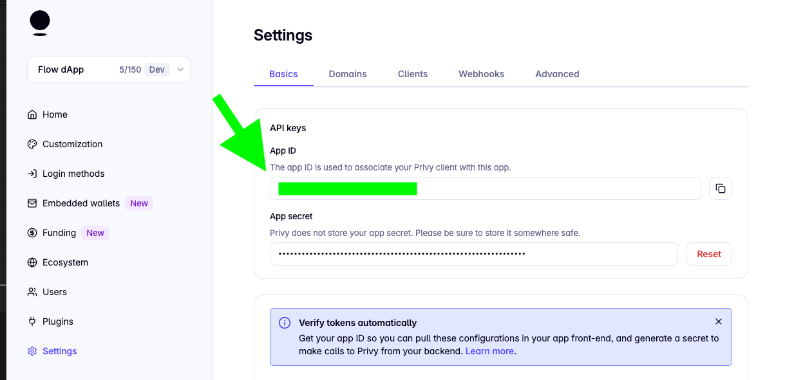
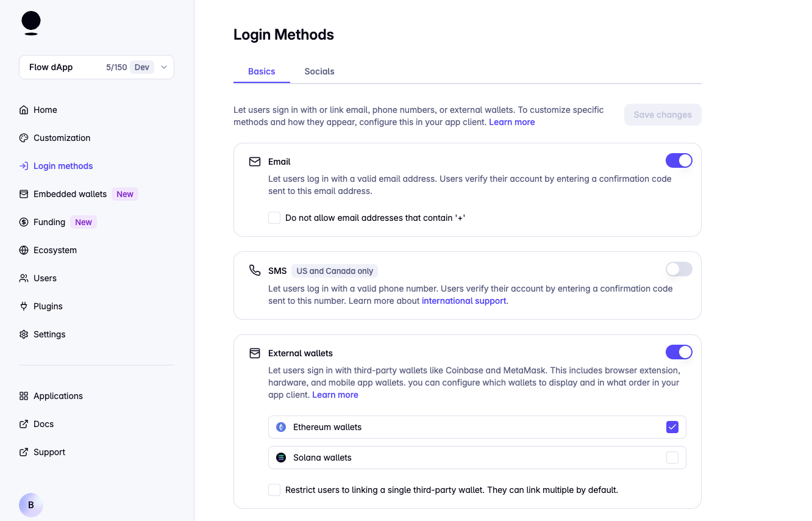
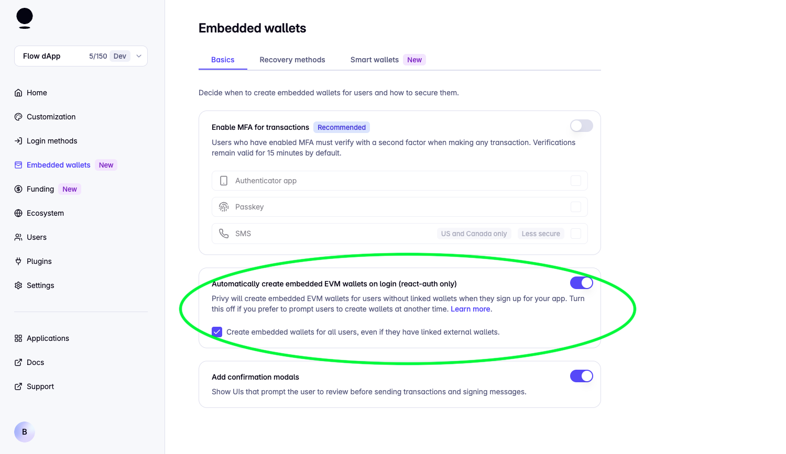
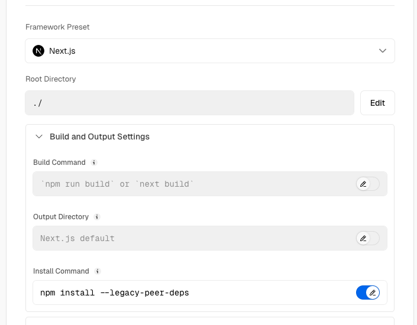
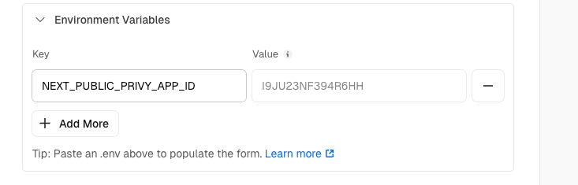
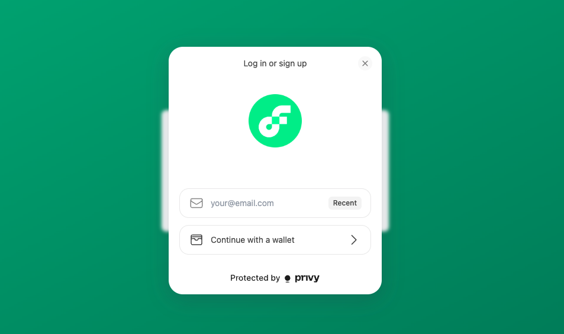

# Connect to Privy.io Wallet on Flow EVM

## Submit Your Solution

-   Submit your deeplink and GitHub repo in the README.md in the [solutions folder](solution/README.md)

## Example

View [Live Demo](https://privy-flow-evm.vercel.app/)

View [Example Code](example/privy-flow-evm-main/)



---

This guide walks you through the steps to set up a Next.js app using Privy Wallet for Flow EVM integration. By the end, you’ll have a working example of login functionality with wallet connection using Privy.

## Step 1: Set Up a Next.js project with TypeScript and App Router

### 1. Run the command in your terminal

```bash
npx create-next-app@latest my-app --typescript
```

### 2. Navigate to Your Project Directory

```bash
cd my-app
```

### 3. Install @privy-io/react-auth@latest and @solana/web3.js with the `--legacy-peer-deps` flag

```bash
npm install @privy-io/react-auth@latest @solana/web3.js --legacy-peer-deps
```

Note: You may encounter some vulnerability warnings (Elliptic, WebSocket, tar, semver, IP package). These do not affect the security or functionality of the Privy Wallet.

## Step 2: Configure Your Privy App

1. Sign in to [Privy.io](https://privy.io/)
2. Create a new application and copy the App ID.

 

3. Set up your app's login methods in the Privy dashboard.

 

4. Set your app to create embedded wallets for all users.

 

## Step 3: Create an `.env` File

Create a .env file in your project root and add your Privy App ID:

```makefile
NEXT_PUBLIC_PRIVY_APP_ID=your-privy-app-id
```

Replace your-privy-app-id with the actual App ID from Step 2.

## Step 4: Update `layout.tsx` to use `PrivyProvider`

Replace the contents of your layout.tsx file with the following code:

```typescript
// app/layout.tsx
'use client';

import './globals.css';
import { PrivyProvider } from '@privy-io/react-auth';
import React, { useEffect, useState } from 'react';

export default function RootLayout({
	children,
}: {
	children: React.ReactNode;
}) {
	// State to track app initialization
	const [isAppInitialized, setIsAppInitialized] = useState(false);

	useEffect(() => {
		// Ensure that the app ID exists before initializing Privy
		if (!process.env.NEXT_PUBLIC_PRIVY_APP_ID) {
			console.error(
				'Privy app ID is missing. Ensure NEXT_PUBLIC_PRIVY_APP_ID is set in your environment variables.'
			);
		} else {
			setIsAppInitialized(true);
		}
	}, []);

	return (
		<html lang="en">
			<body suppressHydrationWarning={true}>
				{isAppInitialized ? (
					<PrivyProvider
						appId={process.env.NEXT_PUBLIC_PRIVY_APP_ID!}
						config={{
							appearance: {
								theme: 'light',
								accentColor: '#676FFF',
								logo: 'https://cryptologos.cc/logos/flow-flow-logo.png', // Replace with your logo
							},
							embeddedWallets: {
								createOnLogin: 'all-users',
							},
							// Flow EVM configuration
							defaultChain: {
								id: 747,
								name: 'Flow',
								network: 'flow',
								nativeCurrency: {
									name: 'Flow',
									symbol: 'FLOW',
									decimals: 18,
								},
								rpcUrls: {
									default: {
										http: [
											'https://mainnet.evm.nodes.onflow.org',
										],
									},
								},
								blockExplorers: {
									default: {
										name: 'Flowscan',
										url: 'https://evm.flowscan.io/',
									},
								},
							},
							supportedChains: [
								{
									id: 747,
									name: 'Flow',
									network: 'flow',
									nativeCurrency: {
										name: 'Flow',
										symbol: 'FLOW',
										decimals: 18,
									},
									rpcUrls: {
										default: {
											http: [
												'https://mainnet.evm.nodes.onflow.org',
											],
										},
									},
									blockExplorers: {
										default: {
											name: 'Flowscan',
											url: 'https://evm.flowscan.io/',
										},
									},
								},
							],
						}}
					>
						{children}
					</PrivyProvider>
				) : (
					<div>
						<h1>Application Error</h1>
						<p>
							Privy app ID is not set. Please check your
							configuration.
						</p>
					</div>
				)}
			</body>
		</html>
	);
}
```

## Step 5: Create `LoginWithPrivy.tsx` Component

Create `components` folder and `LoginWithPrivy.tsx` file with the following code:

```typescript
// components/LoginWithPrivy.tsx
'use client';

import { usePrivy } from '@privy-io/react-auth';

export default function LoginWithPrivy() {
	const { ready, authenticated, login, logout, user } = usePrivy();

	if (!ready) return <p className="text-center text-gray-600">Loading...</p>;

	return (
		<div className="page-container">
			<div className="card">
				{authenticated ? (
					<div>
						{user?.email && (
							<p className="connected-text">
								Welcome,{' '}
								<span className="connected-username">
									{String(user?.email?.address)}
								</span>
								!
							</p>
						)}
						<p className="connected-text">
							Connected Wallet:{' '}
							<span className="connected-username">
								{user?.wallet?.address}
							</span>
						</p>
						<button
							onClick={logout}
							className="button button-disconnect bg-gray-500 text-white font-semibold w-full py-2 rounded-md mt-4 hover:bg-gray-600 transition"
						>
							Logout
						</button>
					</div>
				) : (
					<div>
						<h1 className="card-title text-black">Sign In</h1>
						<p className="card-subtitle text-gray-600">
							Connect with Privy to get started
						</p>
						<button
							onClick={login}
							className="button button-connect bg-green-500 text-white font-semibold w-full py-2 rounded-md hover:bg-green-600 transition"
						>
							Login with Privy
						</button>
					</div>
				)}
			</div>
		</div>
	);
}
```

## Step 6: Update `app/page.tsx`

Update `app/page.tsx` with the following code:

```typescript
// app/page.tsx
import LoginWithPrivy from '@/components/LoginWithPrivy';

export default function HomePage() {
	return (
		<main>
			<LoginWithPrivy />
		</main>
	);
}
```

## Step 7: Add Optional Styles

(Optional) You can add a stylesheet using Tailwind CSS for basic styling. Here's a sample `globals.css` setup:

```css
/* globals.css */
@tailwind base;
@tailwind components;
@tailwind utilities;

:root {
	--background: #ffffff;
	--foreground: #171717;
}

@media (prefers-color-scheme: dark) {
	:root {
		--background: #0a0a0a;
		--foreground: #ededed;
	}
}

body {
	color: var(--foreground);
	background: var(--background);
	font-family: Arial, Helvetica, sans-serif;
}

.page-container {
	min-height: 100vh;
	display: flex;
	align-items: center;
	justify-content: center;
	background: linear-gradient(to bottom right, #10b981, #047857);
}

.card {
	background-color: #ffffff;
	border-radius: 0.5rem;
	box-shadow: 0px 4px 12px rgba(0, 0, 0, 0.1);
	padding: 2rem;
	width: 100%;
	max-width: 24rem;
}

.card-title {
	font-size: 1.875rem; /* text-3xl */
	font-weight: 700; /* font-bold */
	text-align: center;
	margin-bottom: 0.5rem;
	color: black;
}

.card-subtitle {
	color: #4b5563; /* text-gray-600 */
	text-align: center;
	margin-bottom: 1.5rem;
}

.connected-text {
	text-align: center;
	color: #374151; /* text-gray-700 */
}

.connected-username {
	font-weight: 500;
	font-family: monospace;
	word-wrap: break-word;
	word-break: break-all;
	overflow-wrap: anywhere;
	display: inline-block;
}

.button {
	width: 100%;
	padding: 0.5rem 1rem;
	font-weight: 600; /* font-semibold */
	border-radius: 0.5rem;
	transition: background-color 0.2s ease-in-out;
	color: #ffffff;
}

.button-connect {
	background-color: #10b981; /* bg-green-500 */
}

.button-connect:hover {
	background-color: #047857; /* hover:bg-green-600 */
}

.button-disconnect {
	background-color: #6b7280; /* bg-gray-500 */
}

.button-disconnect:hover {
	background-color: #4b5563; /* hover:bg-gray-600 */
}
```

## Step 8: Deploy Your Frontend App

1. Deploy your Next.js app to [Vercel](https://vercel.com/) (or your preferred hosting platform)
   Note: When deploying on Vercel. Make sure to change the install command as following:

```bash
npm install --legacy-peer-deps
```



2. Add your NEXT_PUBLIC_PRIVY_APP_ID environment variable in the Vercel dashboard.





## Conclusion

You've now set up a Next.js app integrated with Privy Wallet for Flow EVM! 🎉
You can turn your dApp with Privy into a Telegram Web App by following [Course 1: Deploy A Telegram Web App](../Course_1_Deploy_A_Telegram_Web_App/)
